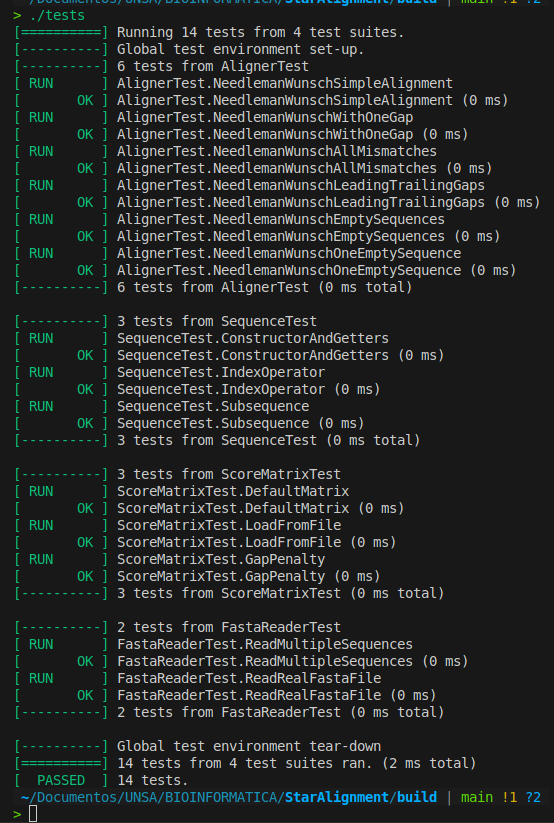

# StarAlignment

By Leon Davis

StarAlignment es una herramienta para el alineamiento de secuencias biológicas basada en el algoritmo STAR (Spliced Transcripts Alignment to a Reference). El proyecto incluye funcionalidades para leer archivos FASTA, manejar secuencias y matrices de puntuación, realizar alineamientos y evaluar resultados. Está implementado en C++ con soporte para pruebas unitarias usando GoogleTest.

## Instalación

Clona el repositorio:

```bash
git clone https://github.com/LeonDavisCoropuna/StarAlignment.git
cd StarAlignment
```

Crea y entra en el directorio de compilación:

```bash
mkdir -p build && cd build
cmake ..
make
```

Para ejecutar los tests, estando dentro de la carpeta `build`, corre:

```bash
./tests
```

## Estructura del proyecto

```
.
├── data
│   └── frataxin_mamiferos.fasta      # Archivo de datos de ejemplo
├── include                          # Headers de las clases
│   ├── Aligner.h
│   ├── FastaReader.h
│   ├── ScoreMatrix.h
│   ├── Sequence.h
│   └── StarAlignment.h
├── src                              # Código fuente
│   ├── Aligner.cpp
│   ├── FastaReader.cpp
│   ├── main.cpp
│   ├── ScoreMatrix.cpp
│   ├── Sequence.cpp
│   └── StarAlignment.cpp
├── tests                            # Pruebas unitarias
│   ├── TestAligner.cpp
│   ├── TestFasta.cpp
│   ├── test_main.cpp
│   ├── TestScoreMatrix.cpp
│   ├── TestSequence.cpp
│   └── TestStarAlignment.cpp
├── CMakeLists.txt                  # Configuración para CMake
└── README.md                      # Este archivo
```


## Implementación

El proyecto implementa un algoritmo de alineamiento múltiple de secuencias biológicas usando el método **Star Alignment**, basado en alineamientos por pares con Needleman-Wunsch.

### 1. Clase `Aligner` — Algoritmo Needleman-Wunsch

* Método principal: `needlemanWunsch(const Sequence& seq1, const Sequence& seq2, const ScoreMatrix& matrix)`

  * Recibe dos secuencias (`seq1` y `seq2`) y una matriz de puntuación para el alineamiento.
  * Crea dos matrices internas:

    * `score_matrix` para almacenar los puntajes acumulados.
    * `direction_matrix` para registrar las direcciones de movimiento para el *backtracking* (Diagonal, Arriba o Izquierda).
  * Inicializa la primera fila y columna considerando penalizaciones por gaps (brechas).
  * Llena la matriz usando la fórmula clásica de Needleman-Wunsch, considerando:

    * Match/mismatch (Diagonal)
    * Inserción (Izquierda)
    * Borrado (Arriba)
  * Realiza *backtracking* para reconstruir la mejor alineación de las secuencias a partir de `direction_matrix`.
  * Devuelve las dos secuencias alineadas y el puntaje final.

* Método auxiliar: `traceback()`

  * Construye las secuencias alineadas comenzando desde la esquina inferior derecha de la matriz y recorriéndola según las direcciones guardadas.
  * Las secuencias se construyen al revés y luego se invierten para devolver el resultado correcto.

---

### 2. Clase `FastaReader`

* Método principal: `readFastaFile(const std::string &filename)`

  * Lee un archivo en formato FASTA con una o más secuencias.
  * Ignora líneas vacías y caracteres `\r`.
  * Extrae identificadores de secuencia (líneas que comienzan con '>') y la secuencia biológica asociada.
  * Devuelve un vector de objetos `Sequence` con los datos cargados.

---

### 3. Clase `Sequence`

* Representa una secuencia biológica con un identificador (`id`) y los datos de la secuencia.
* Proporciona métodos para acceder a:

  * Identificador (`getId()`)
  * Datos (`getData()`)
  * Longitud (`getLength()`)
  * Acceso individual a bases por índice (`operator[]`)
  * Sub-secuencias (`subsequence()`)

---

### 4. Clase `ScoreMatrix`

* Maneja una matriz de puntajes para comparar caracteres (por ejemplo, nucleótidos).
* Permite cargar una matriz desde archivo o inicializar una matriz por defecto (simple, con +1 para match y -1 para mismatch).
* Proporciona métodos para obtener el puntaje entre dos caracteres y para configurar la penalización por gaps.

---

### 5. Clase `StarAlignment`

* Método principal: `align(const vector<Sequence>& sequences, const ScoreMatrix& matrix)`

  * Implementa el algoritmo de alineamiento múltiple por método *Star*.
  * Primero identifica la secuencia central, aquella con mayor puntuación total al alinearse con todas las demás, utilizando la función `findCenterSequence`.
  * Luego realiza alineamientos por pares entre la secuencia central y cada otra secuencia.
  * Combina las secuencias alineadas en un resultado múltiple (de forma simple, sin manejo complejo de gaps conjuntos).
  * Devuelve un vector con las secuencias alineadas en formato string.

* Método auxiliar: `findCenterSequence()`

  * Evalúa cada secuencia como posible centro sumando los puntajes de sus alineamientos con todas las demás.
  * Selecciona la que maximiza esta suma como secuencia central.

---

### 6. Programa principal (`main.cpp`)

* Carga las secuencias desde archivo FASTA usando `loadSequences`.
* Carga la matriz de puntajes desde archivo.
* Ejecuta la función `StarAlignment::align` para obtener las secuencias alineadas.
* Imprime los resultados en la consola.


## Tests

### Tests para **Aligner** (alineamiento Needleman-Wunsch)

Estos tests verifican que el algoritmo de alineamiento funcione correctamente en distintos escenarios:

* **NeedlemanWunschSimpleAlignment:**
  Compara dos secuencias idénticas `"ACGT"` vs `"ACGT"`.

  * Resultado esperado: alineamiento perfecto, sin gaps ni mismatches.
  * Puntuación esperada: 4 (4 matches × 1 punto cada uno).

* **NeedlemanWunschWithOneGap:**
  Compara `"ACGT"` con `"AGT"`, que tiene una letra menos (un gap esperado).

  * Resultado esperado: un gap introducido en la segunda secuencia para alinear.
  * Puntuación: calculada con match=+1, gap=-5 → 1 -5 +1 +1 = -2.

* **NeedlemanWunschAllMismatches:**
  Secuencias totalmente diferentes `"AAAA"` y `"TTTT"`.

  * Resultado esperado: alineamiento sin gaps pero con mismatches.
  * Puntuación: 4 mismatches × -1 = -4.

* **NeedlemanWunschLeadingTrailingGaps:**
  Secuencias con diferencias de longitud y necesidad de gaps al principio y al final: `"CGT"` vs `"ACGTG"`.

  * Verifica que las cadenas alineadas tengan la misma longitud y que la puntuación coincida con el cálculo esperado considerando gaps y matches.

* **NeedlemanWunschEmptySequences:**
  Ambas secuencias vacías.

  * Resultado esperado: alineamiento vacío y puntuación 0.

* **NeedlemanWunschOneEmptySequence:**
  Una secuencia vacía y otra con `"ACGT"`.

  * La secuencia vacía se alinea con gaps (4 guiones).
  * Puntuación: gap penalty × longitud de la secuencia = -5 × 4 = -20.

---

### Tests para **FastaReader** (lectura de archivos fasta)

* **ReadMultipleSequences:**

  * Usa un archivo temporal con dos secuencias en formato FASTA (ratón y rata).
  * Verifica que se lean correctamente dos secuencias, con sus IDs completos y fragmentos iniciales correctos.
  * Finalmente elimina el archivo temporal para limpieza.

* **ReadRealFastaFile:**

  * Lee un archivo real externo (ruta `"../data/frataxin_mamiferos.fasta"`).
  * Verifica que haya al menos dos secuencias y que el contenido de los IDs y datos concuerde con lo esperado (fragmentos iniciales).

---

### Tests para **ScoreMatrix** (matriz de puntajes y gap penalty)

* **DefaultMatrix:**

  * Comprueba los valores por defecto (match=+1, mismatch=-1, gap penalty=-5).
  * Ejemplo: score('A','A')=1, score('A','C')=-1.

* **LoadFromFile:**

  * Crea un archivo temporal con una matriz personalizada y la carga.
  * Comprueba que los valores cargados son correctos.
  * El archivo temporal se elimina al final.

* **GapPenalty:**

  * Cambia el gap penalty y verifica que el cambio se refleje correctamente.

---

### Tests para **Sequence** (clase de secuencia biológica)

* **ConstructorAndGetters:**

  * Verifica que el constructor inicialice correctamente el ID, los datos y la longitud.

* **IndexOperator:**

  * Testea que el operador `[]` devuelva la base correcta en cada posición.
  * También verifica que acceder fuera de rango lance una excepción.

* **Subsequence:**

  * Comprueba que la función para obtener subcadenas devuelva el fragmento correcto.
  * Verifica que pasar índices inválidos lance excepción.

### Main de tests

```cpp
int main(int argc, char **argv) {
    ::testing::InitGoogleTest(&argc, argv);
    return RUN_ALL_TESTS();
}
```

Este es el punto de entrada para ejecutar todos los tests con Google Test, y al ejecutar ./tests se obtiene la siguiente imagen


